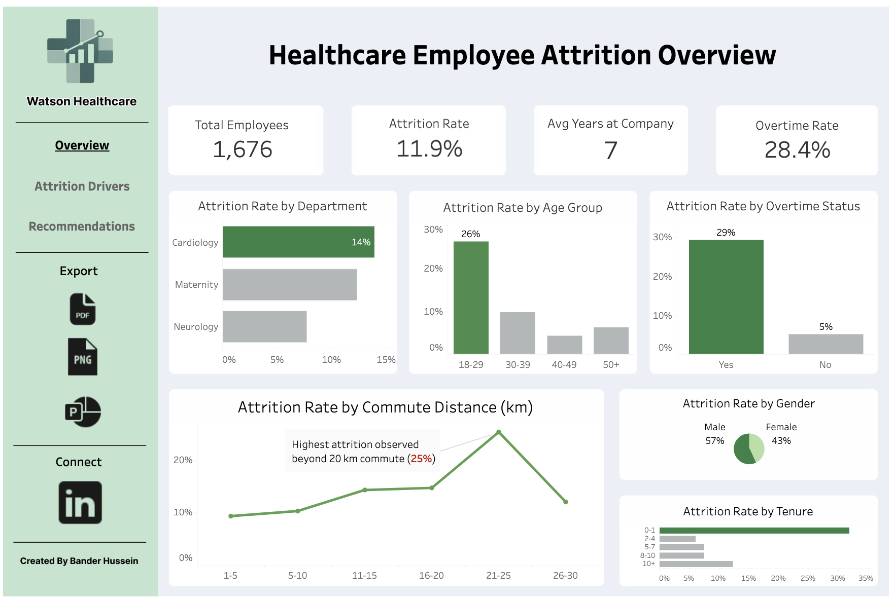
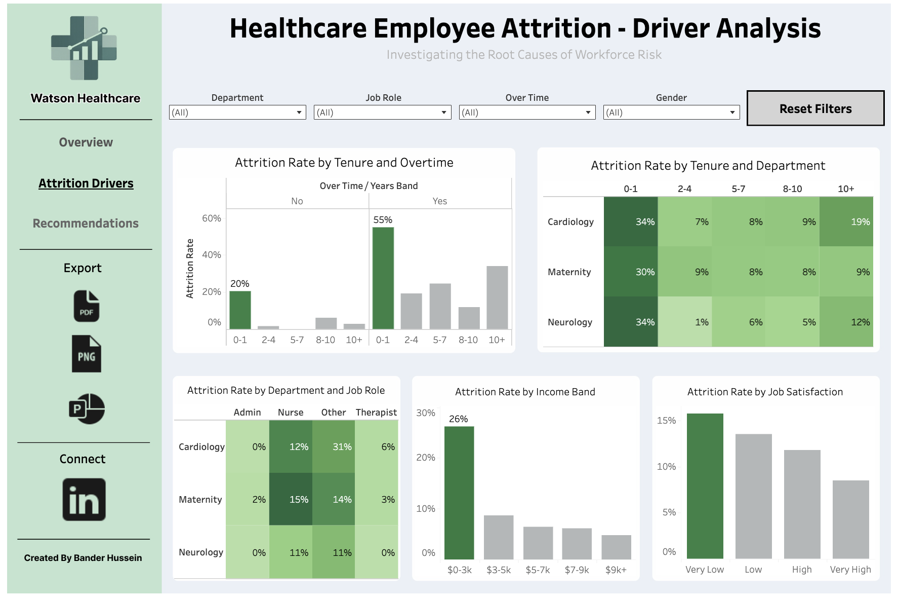
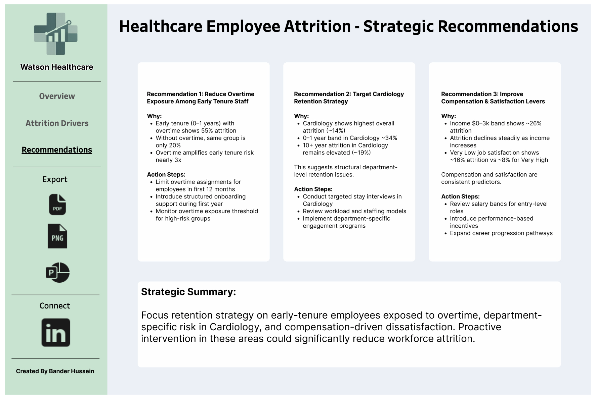

# Healthcare Employee Attrition Analysis

## Overview
This project analyzes employee attrition within a healthcare organization to identify key drivers of workforce turnover and support data-driven retention strategies.

The analysis combines SQL-based data exploration with an interactive Tableau dashboard and executive-level recommendations to simulate a real-world business analytics workflow.

## Tech Stack
- SQL (MySQL)
- Tableau

## Project Workflow

### 1. Data Preparation (SQL)
- Created a derived `attrition_flag` column to quantify employee turnover (1 = left, 0 = stayed)
- Calculated core KPIs such as total employees, employees who left, and attrition rate
- Aggregated and analyzed attrition across multiple dimensions:
  - Department
  - Job Role
  - Age
  - Overtime
  - Tenure
  - Income Band
  - Job Satisfaction

### 2. Analysis & Visualization (Tableau)
- Designed an executive-style dashboard with:
  - KPI summary (attrition rate, total employees, overtime rate)
  - Department and demographic breakdowns
  - Attrition driver analysis (tenure, overtime, income, satisfaction)
- Built a multi-page layout:
  - Overview
  - Driver Analysis
  - Strategic Recommendations

### 3. Business Recommendations
- Translated analytical findings into targeted retention strategies
- Focused on high-risk workforce segments and actionable interventions

## Key Insights

- **Early-tenure employees (0–1 years)** show the highest attrition (~34%)
- **Overtime significantly amplifies risk**, increasing early-tenure attrition to ~55%
- **Cardiology department exhibits the highest structural attrition risk (~14%)**
- **Lower income bands ($0–3k)** experience elevated attrition (~26%)
- **Job satisfaction strongly impacts retention**, with ~16% attrition at very low satisfaction vs ~8% at very high


## Business Impact

- Identified **high-risk employee segments** for targeted intervention
- Demonstrated how overtime and early tenure combine to drive attrition risk
- Highlighted structural department-level issues requiring focused strategies
- Estimated that reducing attrition by **3–5% could retain 50–80 employees annually**
- Provided actionable recommendations to improve retention and workforce stability

## Dashboard
View the interactive Tableau dashboard:  
https://public.tableau.com/app/profile/bander.hussein/viz/HealthcareDashboard_17722712211600/Overview

## Dashboard Preview





## Project Deliverables

- SQL analysis (`analysis.sql`)
- Tableau dashboard (Overview, Driver Analysis, Recommendations)
- Executive presentation slides (`slides/Healthcare Dashboard Slides.pdf`)

## Repository Structure

```
healthcare-employee-attrition-analysis/
│
├── README.md
├── analysis.sql
├── slides/
│   └── Healthcare Dashboard Slides.pdf
├── images/
│   ├── overview.png
│   ├── drivers.png
│   └── recommendations.png
└── data/
    └── watson_healthcare_modified2.csv
```
